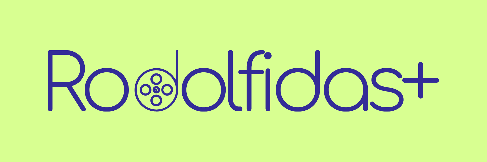
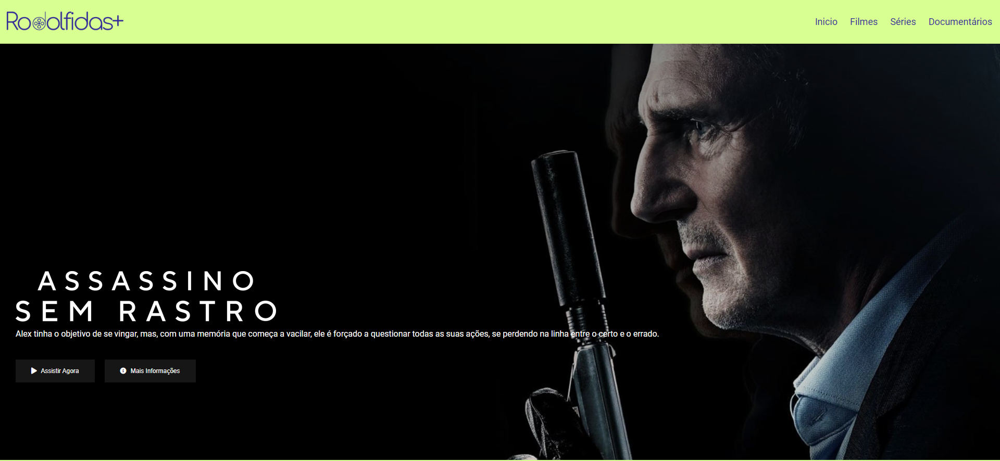
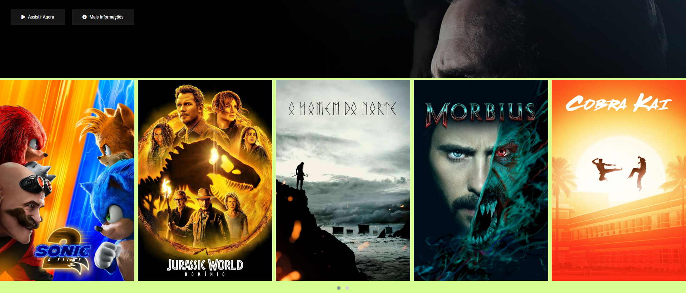
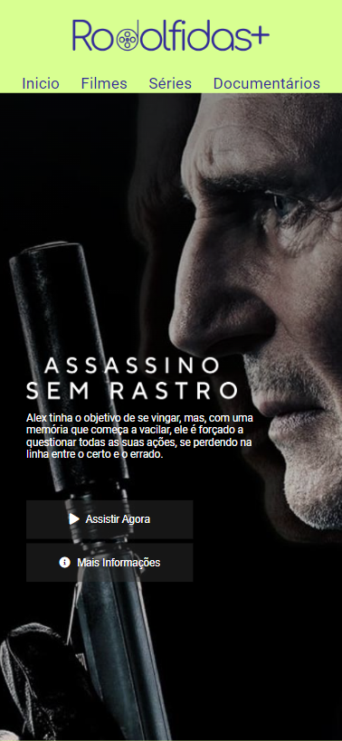
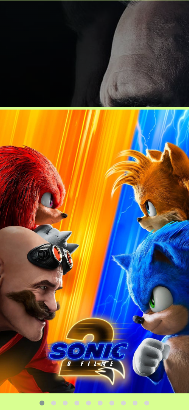

## Sobre o projeto
 - Projeto desenvolvido durante o bootcamp da DIO, "HTML Web Developer", com o objetivo de recriar a página principal da NETFLIX.

## Objetivos
- Fixar conteúdos do HTML, CSS e JavaScript;
- Técnicas para melhorar a produtividade como programador;
- Utilização do plugin **JQuery**;
- Responsabilidade. 

## 💻Tecnologias Utilizadas💻
- HTML;
- CSS;
- JavaScript;
- JQuery.

## Extras
- Nova identidade visual.

## Visão Geral do Projeto

## Visão Geral do Projeto - Modo Responsivo

## 🚀 Bora pra cima. 🚀.
